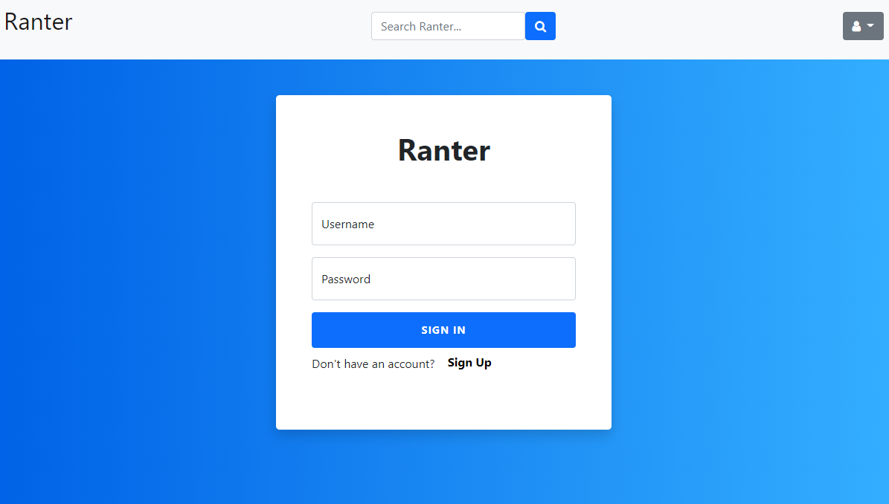
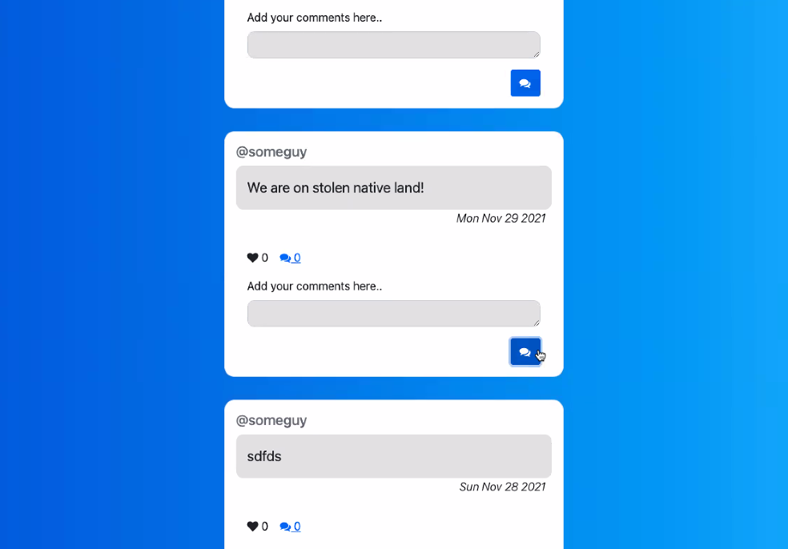

# Ranter 

## Description

Ranter is a the first iteration of a blog post website, primarily modelled on Twitter functionality, to demonstrate our skills in building a full-stack application and following the Model-View-Controller structure. Ranter allows you to create a user profile, to follow other users, to add posts and comments, and to like others' posts and comments too.

To use Ranter, you'll need to create a user account first. To add other users' posts to your feed, you will need to search by username. 

## Technologies Used

* Node.js
* Express.js
* Handlebars
* Sequelize, MySQL
* JavaScript
* HTML, CSS
* Bootstrap
* Deployed on Heroku

## Deployed Application

https://ranter2-0.herokuapp.com/login

## Screenshots

## Contributions

 - Felicity Brammer - *felicitybrammer* [click here to see Github profile](github.com/felicitybrammer)
 - William Weiland - *maplesyrupman* [click here to see Github profile](github.com/maplesyrupman) 
 - Jasmine Ashley - *jasmin3ashl3y* [click here to see Github profile](github.com/jasmin3ashl3y)
